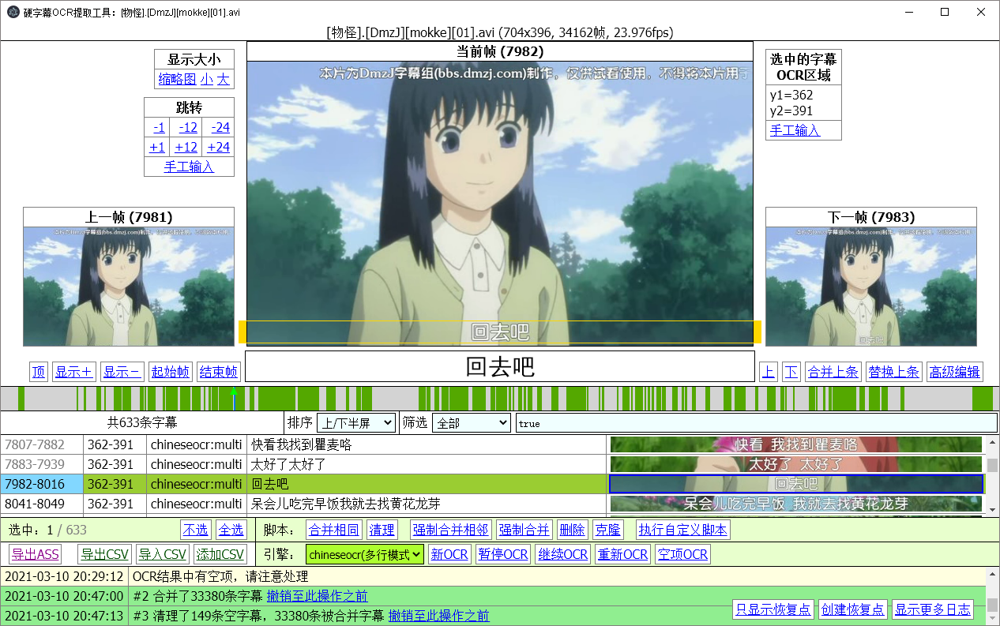

# video2sub

## 硬字幕OCR提取工具

video2sub 提供图形界面，方便执行字幕 OCR 识别、编辑、校对等操作。

video2sub 本身没有实现任何 OCR 识别算法，而是使用外部库进行 OCR 识别。目前支持 [chineseocr](https://github.com/chineseocr/chineseocr) 和[百度文字识别 API](https://ai.baidu.com/tech/ocr/general)。其中 chineseocr 支持离线运行，而百度文字识别 API 需要联网运行。建议先用 chineseocr 识别出哪些帧含有字幕，再调用百度文字识别 API 进行精确识别。

## 下载地址

- [**百度网盘**](https://pan.baidu.com/s/1sLc22mr1PUh0X2HYXnAQzg) （提取码: **ydkn**）

|文件名|说明|
|-|-|
|video2sub-20210305.zip|下载后解压并运行 **launcher.exe** 即可。|
|chineseocr-gpu.zip|GPU 版 chineseocr 识别引擎，需要 NVIDIA 显卡。下载后解压并运行 **chineseocr-gpu.exe** 即可。
|chineseocr-cpu.zip|CPU 版 chineseocr 识别引擎，无需显卡，但速度很慢，不建议使用。

## 系统需求

- Windows 7 或更高版本
- 4GB 以上内存
- NVIDIA 显卡：用于 chineseocr 加速（纯 CPU 也能运行，就是太慢）
